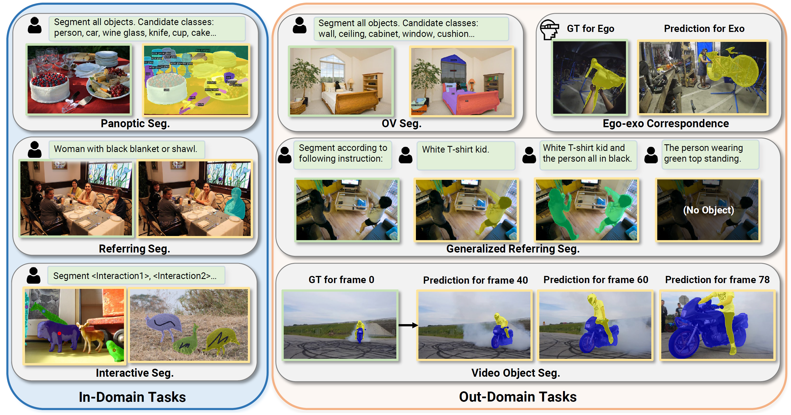

# PSALM: Pixelwise SegmentAtion with Large Multi-Modal Model
> #### Zheng Zhang\*, Yeyao Ma\*, Enming Zhang\*, Xiang Bai
>
> <sup>* Equal Contribution

[Arxiv Paper](https://arxiv.org/abs/2403.14598)

### Features

* A powerful extension of the Large Multi-modal Model for generic (panoptic, instance, semantic) segmentation, referring segmentation and interactivate segmentation.
* Support joint training across multiple segmentation tasks and visual-language tasks.
* Demonstrates zero-shot capabilities on unseen task, such as open-vocabulary segmentation, generalizaed referring segmentation, and video object segmentation.



## Updates
- [x] Release evaluation code
- [x] Release training code
## Installation

See [Installation instructions](docs/INSTALL.md).

## Getting Started

See [Preparing Datasets for PSALM.](docs/DATASET.md)

See [Getting Started with PSALM.](docs/GETTING_STARTED.md)

## Model Zoo
- Download PSALM [here](https://huggingface.co/EnmingZhang/PSALM).

## Citation
If you think this work is useful for your research, please use the following BibTeX entry.
```
@inproceedings{zhang2025psalm,
  title={Psalm: Pixelwise segmentation with large multi-modal model},
  author={Zhang, Zheng and Ma, Yeyao and Zhang, Enming and Bai, Xiang},
  booktitle={European Conference on Computer Vision},
  pages={74--91},
  year={2025},
  organization={Springer}
}
```
## Acknowledgement
Thanks for awesome works: [Mask2former](https://github.com/facebookresearch/Mask2Former/tree/main), [Mask2former-Simplify](https://github.com/zzubqh/Mask2Former-Simplify)
and [LLaVA](https://github.com/haotian-liu/LLaVA). Code is based on these works.
